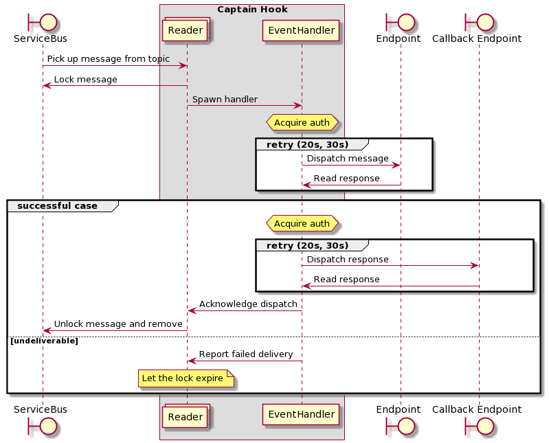
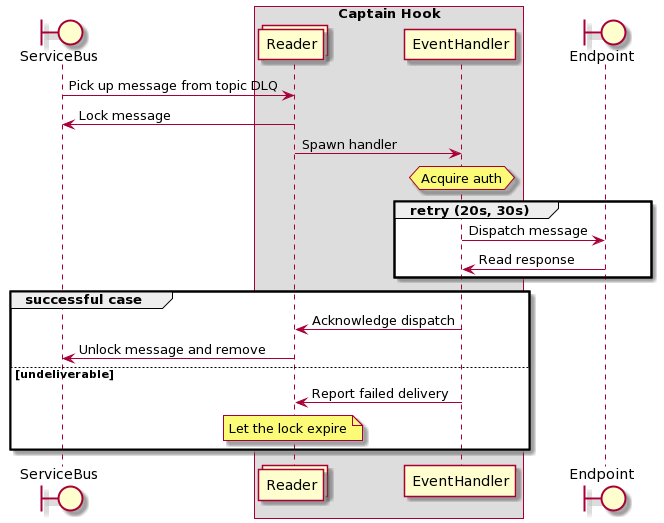
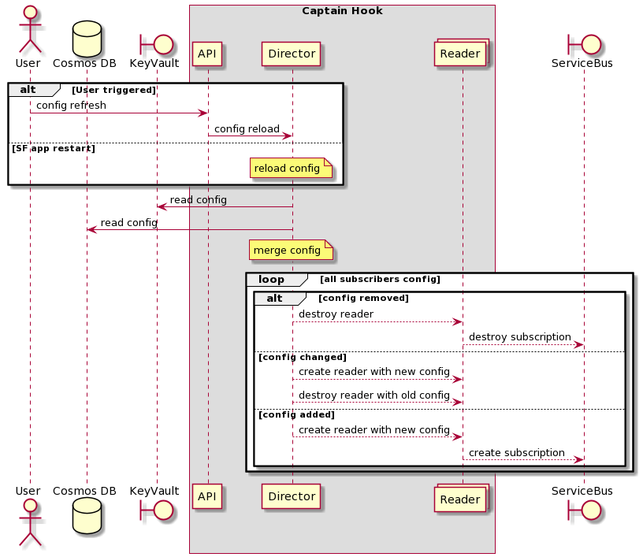
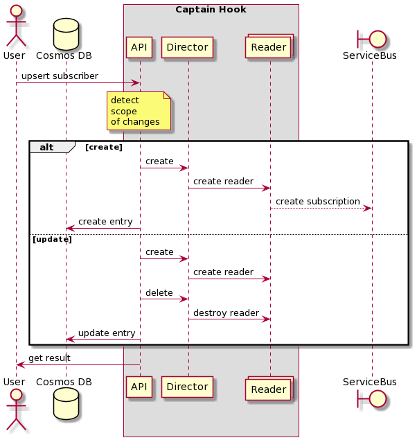

# captain-hook

[](https://eshopworld.visualstudio.com/Github%20build/_build/latest?definitionId=382?branchName=master)
[](https://sonarcloud.io/dashboard?id=esw.captain-hook)

Generic message dispatcher for webhooks using the Actor framework in Service Fabric


## Using EDA

To use the EDA flow, a number of steps need to be setup in the BigBrother Client before you should emit domain events. Additionally, after a domain event is sent from your application this will get routed to a webhook endpoint. The route and destination for this endpoint need to be configured.

1. Create Domain Models which are inherited from DomainEvent Type.
2. Setup Messager client and inject into BigBrother Instance (Using BigBrother.PublishEventsToTopics()). This is used for sending the messages to the ServiceBus Namespace and Topic.
3. Setup Azure Data Explorer (Kusto) to be able to assert on domain events in integration tests (BigBrother.UseKusto())
4. Sent Domain Events to BigBrother via the existing Publish method. (BigBrother.Publish<T>())

### EDA Pre Setup

1. Register Config with Captain Hook
  1. Domain Event Name (full namespace)
  2. Hook URI
  1. Any Auth required for this endpoint
  2. Callback with response
  1. Auth required for the callback endpoint.
  

Per authorisation for internal services, OAuth2 scopes are used to control access to the webhook endpoints. Captain Hook much be allowed to consume this scope. For example, assume a scope of "servicea.webhook.api.all" which has been created by the development team. The scope has been assinged to their controller for authroisation of the endpoints. And the scope has been assigned to Captain Hook in the STS. Further Captain Hook must request this scope when aquiring it's bearer token. The token is then used in all subsequent calls to each internal service.

### Features

#### Multi-Despatch

It is possible to configure Captain Hook to subscribe different webhooks/callbacks to single event. This would be useful if an event starts separate processes in different applications/domains.

#### Return to Sender/DLQ - Dead letter queue - subscription for failure flows

It is possible also to monitor dead letter queue for a given subscription on a topic. Failed messages can be dispatched to a designated webhook for compensating flows.

This webhook uses the following contract. It is envisioned that this contract will also cover callback flows (in happy path as well as failure path). As for webhooks or callbacks, JSON is used to send data on the wire.

The following is the C# definition of the contract, followed by example JSON payload

``` c#

 public interface IWrapperPayloadContract
 {
     JObject Payload { get; set; }        
     string MessageId { get; set; }
     string EventType { get; set; }
     HttpStatusCode? StatusCode { get; set; }
     string StatusUri { get; set; }
     CallbackTypeEnum CallbackType { get; set; }
 }

 public enum CallbackTypeEnum
 {
     Callback,
     DeliveryFailure
 }

```

Sample JSON (failed internal testing event wrapped in a new contract)

``` JSON

{
   "Payload":{
      "Id":"e72c0ce2-6a31-44c5-a4da-4e2b14936c72",
      "StartTime":"2019-09-07T23:04:07.2710048Z",
      "EndTime":"0001-01-01T00:00:00",
      "CallerMemberName":null,
      "CallerFilePath":null,
      "CallerLineNumber":0
   },
   "MessageId":"24f8279c-9f51-41cd-9289-9e046278041b",
   "EventType":"core.events.test.trackingdomainevent",
   "StatusCode":null,
   "StatusUri":null,
   "CallbackType":1
}

```

Please note the JObject usage for the inner message Payload. This allows to deserialize any incoming message into Newtonsoft generic JSON container bag. On a case by case basis - for single payload type expected - it may beneficial to use this contract with inner payload designated using specific type that matches the JSON payload. Depending on your setup, your controller (e.g. ASP.NET/ASP.NET core) will received fully deserialized, strongly typed structure.

For ASP.NET Core 3, the NewtonSoft _JObject_ needs to additionally instrumented for or you can elect to use _JsonElement_ from System.Text.Json namespace.

Note that _StatusUri_ is reserved for future use and will not have a value at present. Stay tuned for Status API to receive full processing history (retries, status code for each attempt etc.) for a given message.

## Things to note

1. Integrations tests should be asserted on Azure Data Explorer Events rather than flows in which require a synchronous response from remote endpoints. Given the async flow, the data will arrive eventually but perhaps not as quickly as an integration test might need. Data will populate in the Kusto Cluster within a number of seconds after the event is fired, integration tests should assert on this. Assert retries with Polly.Net should be implemented to insure that insertions assert on data that has been delivered to the Kusto Cluster.

1. We ensure that message processing are guaranteed. This is important to note that this guarantee exists only after the message has been published to the topic. As such when you "Publish" to the topic this is a synchronous call in BigBrother such that if an exception is thrown while trying to connect to the ServiceBus Topic we will rethrow that exception back up to the caller. Here you will need to handle this, with perhaps, a retry mechanim but at least logging it to Application Insights.

## Sequence diagrams

Here is a collection of sequence diagrams for the main flows.

### Message flow with callback



### Message flow with DLQ



### Captain Hook startup flow



### User-added subscriber flow


## Future Work
* HA for EDA.
* Domain Event Versioning.
* Tenant Namespacing.
